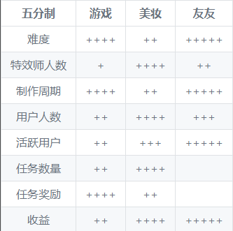

<p align="center">
	
	<!--
	
	-->
	<h1 align="center">抖音像塑特效、快手必扬特效制作教程文档</h1>
	<p align="center">这是抖音特效和快手特效的制作教程</p>
	<a href="https://space.bilibili.com/492950720/" target="_blank"></a>
	<a href="https://v.douyin.com/iyuacpJV/" target="_blank"></a>
	<a href="https://blog.csdn.net/weixin_45738527" target="_blank"></a>

	<!--
	<a href="链接地址" target="_blank"></a>
	-->
</p>

___


@[TOC](标题)

## 目录

[通用](#通用)

[抖音特效](#抖音像塑（DouyinAR）)

[快手特效](#抖音像塑（DouyinAR）)


<!--
[这里写名称](#这里要对应下面的标题，不能有空格)
-->

## 抖音像塑（DouyinAR）
### 新功能
<!--
全部安装包在[网盘](https://me.csdn.net/weixin_45738527)
-->

<details>
	<summary>Douyin_AR_5.3.0</summary>
	<p>收缩内容</p>

</details>
<details>
	<summary>收缩标题</summary>
	<p>收缩内容</p>
</details>

### bug处理方法
### 教程与实战
### 审核规则
### 官方文档链接


## 快手必扬（Beyond Effects）
### 新功能
### bug处理方法
### 教程与实战
### 审核规则
### 官方文档链接

## 通用
### 【如何选合适自己的方向？ 】
一、特效类型有很多，但总体可以分为3大类：  
- 1.游戏（2D游戏，3D游戏）  
- 2.美妆（AI 滤镜，美妆，边框，贴纸）  
- 3.友友-老年人版的美妆（氛围）  

二、游戏
- 基础要求：懂逻辑，会一定的思维能力。懂编程的人，更合适！
- 加分项：计算机专业、逻辑
- 游戏核心：玩法。

三、美妆
- 要求：懂审美，对大众的审美有一定的了解，懂网感妆的人，加分，会用绘图软件画妆容的，更合适！
- 加分项：经常刷美女视频、会用软件画妆容、会用软件画画、
- 美妆核心：妆容、贴纸。

四、友友
- 要求：最基础的要求是会AE做效果（如果懂高阶节点的，也可以替代），对老年人的审美了解。
- 加分项：AE、3D、情感、节点。
- 友友核心：老年人审美。
	
五、对比
|五分制|游戏|美妆|友友|
|:----:|:-----:|:------:|:-----:|
|难度|++++|++|+++++|
|特效师人数|+|++++|++|
|制作周期|++++|++|+++++|
|用户人数|++|++++|+++|
|活跃用户|++|+++|+++++|
|任务数量|++|++++| |
|任务奖励|++++|++| |
|收益|++|++++|+++++|

<!---->


### 运营
### PS

## 最后
### 交流区(Issues)
```
**我是小南郡，码字不易，写教程也不易，如果文章对你有帮助，记得评论点赞加转发收藏哦！感谢支持！！**
```
----
我的抖音主页[**点击传送**](https://v.douyin.com/iyuacpJV/)

我的B站主页：[**点击传送**](https://space.bilibili.com/492950720/)

我的csdn主页：[**点击传送**](https://blog.csdn.net/weixin_45738527)

我的github主页：[**点击传送**](https://github.com/otsluo/otsluo.github.io)

<font color=black>~~特效交流群：暂未创建~~</font>
<font color=black>~~引导交流群：暂未创建~~</font>
</font>
<!--<font face="黑体" color=green size=5>我是黑体，绿色，尺寸为5</font>-->

### 支持项目(Support)


